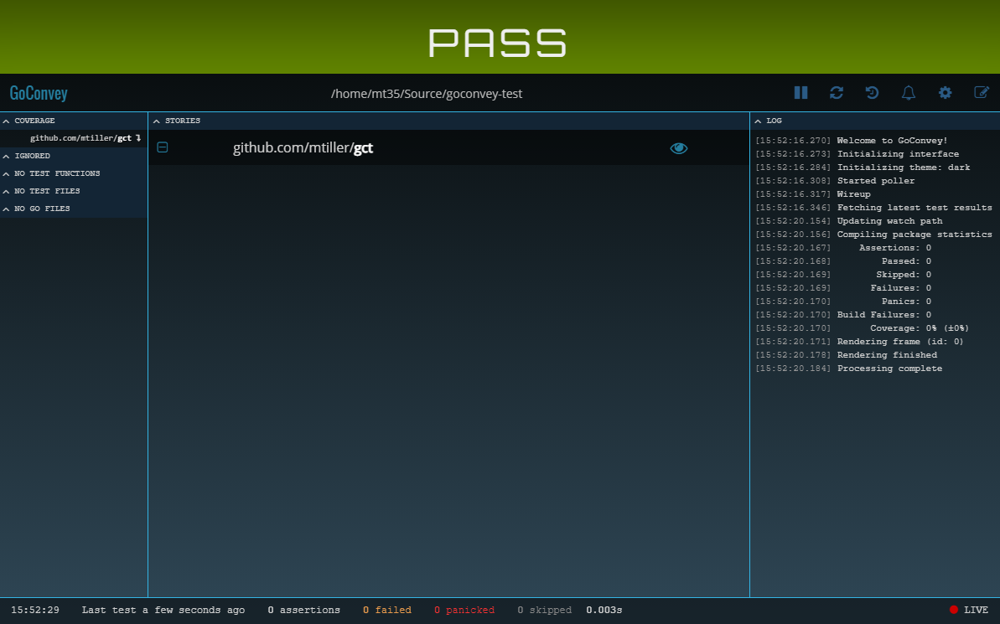

This repository shows a very simple Go module that does not work with `goconvey`
`v1.6.6`. When you run `goconvey` `v1.6.6`, you'll see a bunch of lines that look
like this in the output:

```
2021/10/20 16:04:11 goconvey.go:61: Initial configuration: [host: 127.0.0.1] [port: 8080] [poll: 250ms] [cover: true]
2021/10/20 16:04:11 tester.go:19: Now configured to test 10 packages concurrently.
2021/10/20 16:04:11 goconvey.go:203: Serving HTTP at: http://127.0.0.1:8080
2021/10/20 16:04:11 goconvey.go:105: Launching browser on 127.0.0.1:8080
2021/10/20 16:04:11 integration.go:122: File system state modified, publishing current folders... 0 4904277887
2021/10/20 16:04:11 goconvey.go:118: Received request from watcher to execute tests...
2021/10/20 16:04:12 executor.go:69: Executor status: 'executing'
2021/10/20 16:04:12 coordinator.go:46: Executing concurrent tests: github.com/mtiller/gct
Potential error parsing output of github.com/mtiller/gct ; couldn't handle this stray line: .x
Potential error parsing output of github.com/mtiller/gct ; couldn't handle this stray line: Failures:
Potential error parsing output of github.com/mtiller/gct ; couldn't handle this stray line:
Potential error parsing output of github.com/mtiller/gct ; couldn't handle this stray line: * /home/mt35/Source/goconvey-test/add_test.go
Potential error parsing output of github.com/mtiller/gct ; couldn't handle this stray line: Line 12:
Potential error parsing output of github.com/mtiller/gct ; couldn't handle this stray line: Expected: '6'
Potential error parsing output of github.com/mtiller/gct ; couldn't handle this stray line: Actual:   '5'
Potential error parsing output of github.com/mtiller/gct ; couldn't handle this stray line: (Should be equal)
Potential error parsing output of github.com/mtiller/gct ; couldn't handle this stray line:
Potential error parsing output of github.com/mtiller/gct ; couldn't handle this stray line:
Potential error parsing output of github.com/mtiller/gct ; couldn't handle this stray line: 2 total assertions
Potential error parsing output of github.com/mtiller/gct ; couldn't handle this stray line:
2021/10/20 16:04:12 parser.go:24: [failed]: github.com/mtiller/gct
2021/10/20 16:04:12 executor.go:69: Executor status: 'idle'
2021/10/20 16:04:13 goconvey.go:113:
```

But when you run v1.6.4, you don't see this:

```
2021/10/20 16:03:32 goconvey.go:61: Initial configuration: [host: 127.0.0.1] [port: 8080] [poll: 250ms] [cover: true]
2021/10/20 16:03:32 tester.go:19: Now configured to test 10 packages concurrently.
2021/10/20 16:03:32 goconvey.go:178: Serving HTTP at: http://127.0.0.1:8080
2021/10/20 16:03:32 integration.go:122: File system state modified, publishing current folders... 0 4904277887
2021/10/20 16:03:32 goconvey.go:105: Launching browser on 127.0.0.1:8080
2021/10/20 16:03:32 goconvey.go:118: Received request from watcher to execute tests...
2021/10/20 16:03:32 executor.go:69: Executor status: 'executing'
2021/10/20 16:03:32 coordinator.go:46: Executing concurrent tests: github.com/mtiller/gct
2021/10/20 16:03:33 parser.go:24: [failed]: github.com/mtiller/gct
2021/10/20 16:03:33 executor.go:69: Executor status: 'idle'
2021/10/20 16:03:33 goconvey.go:113:
```

This might seem like a superficial issue, but it is indicative of a deeper
problem which manifests itself more seriously in the web interface.
Specifically, the test failure in the code triggers some issue with parsing
output in the `goconvey` CLI tool which causes the all results of that test to
be complete masked (successes and failures).

When working, the web interface looks like this:


But when using `v1.6.6`, you see that both the successful assertions and the
failed assertions are missing:



It is worth pointing out that this seems to be localized to the CLI tool. You
can switch the library used to import the `Convey` and `So` functions from
either `v1.6.4` or `v1.6.6` and they will both work with CLI `v1.6.4` but
neither will work with CLI `v1.6.6`.
